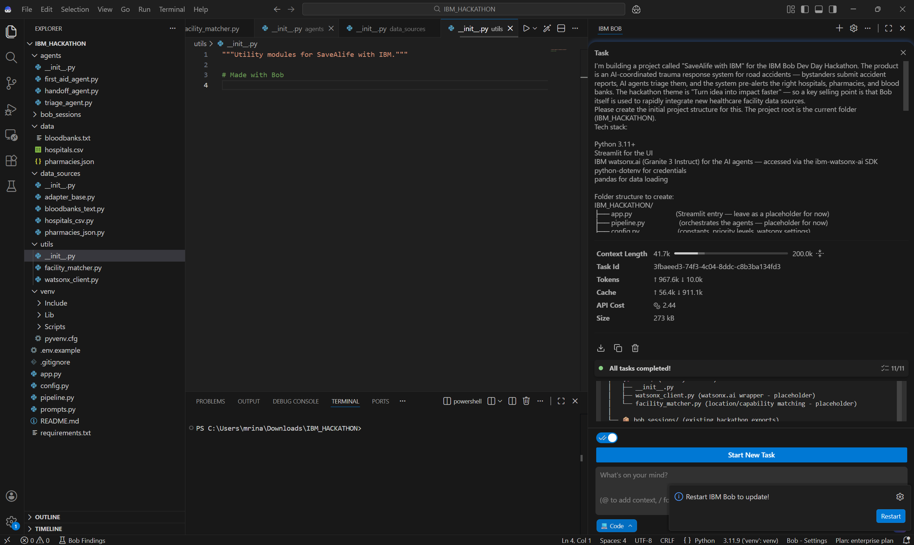
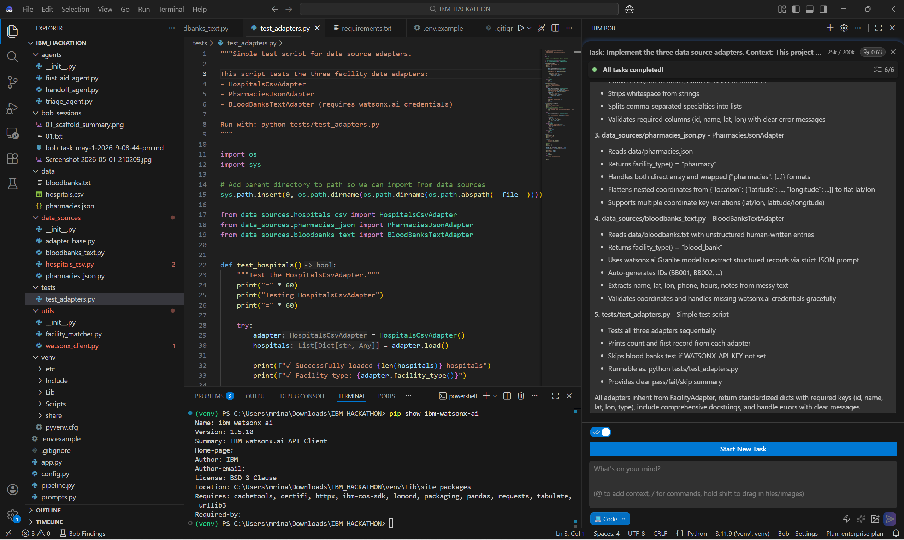
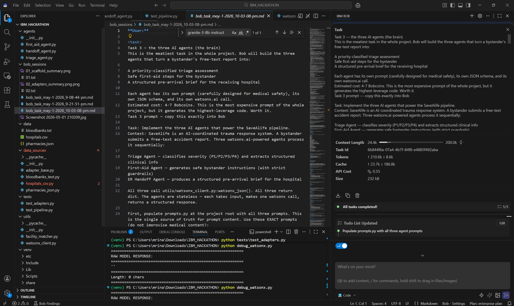
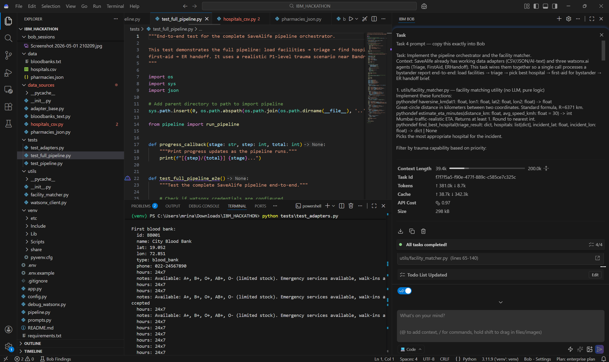
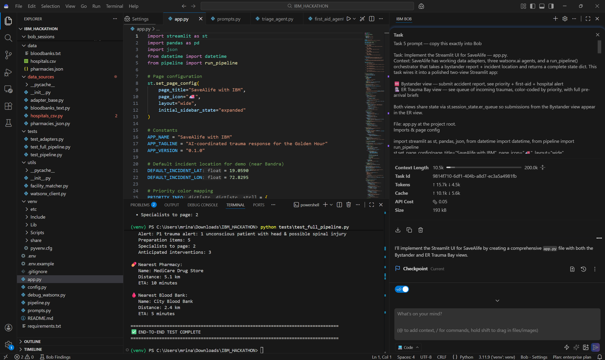
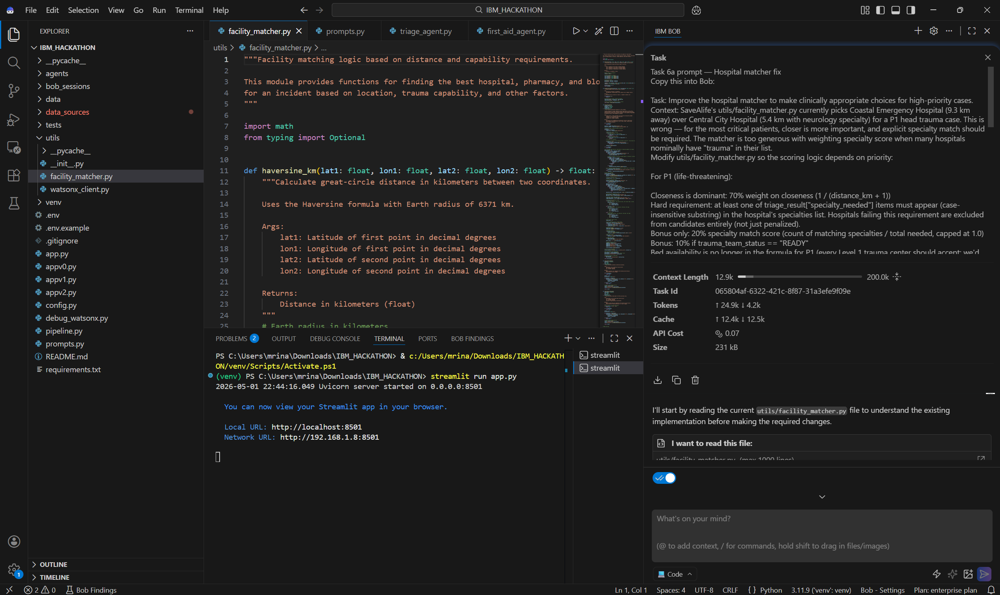
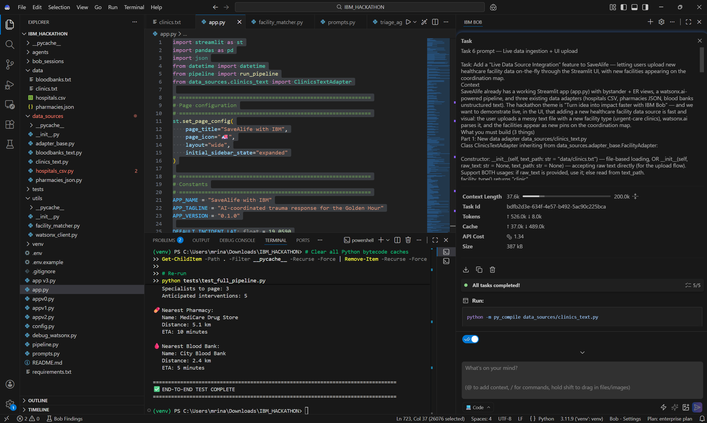
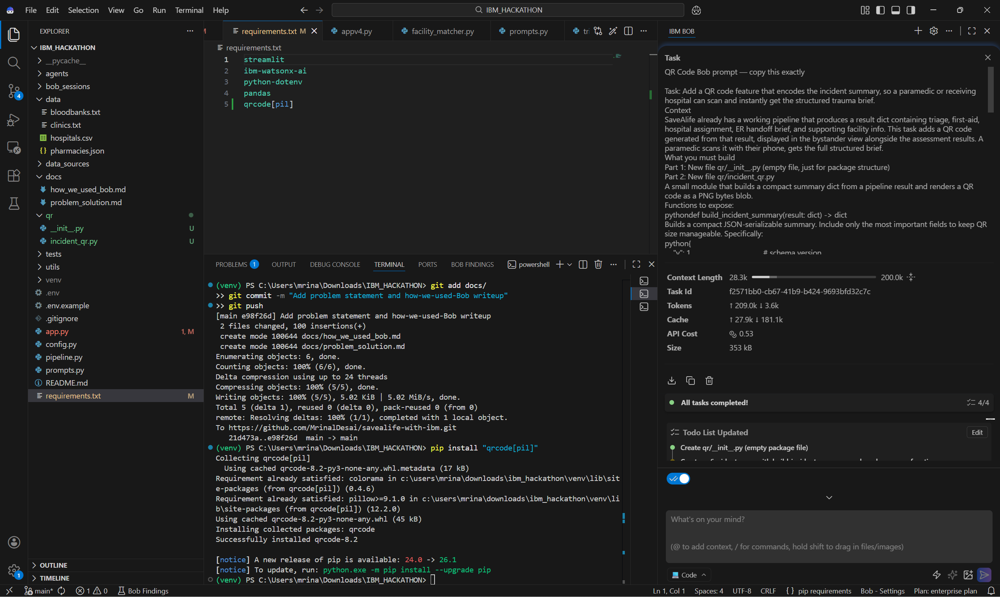
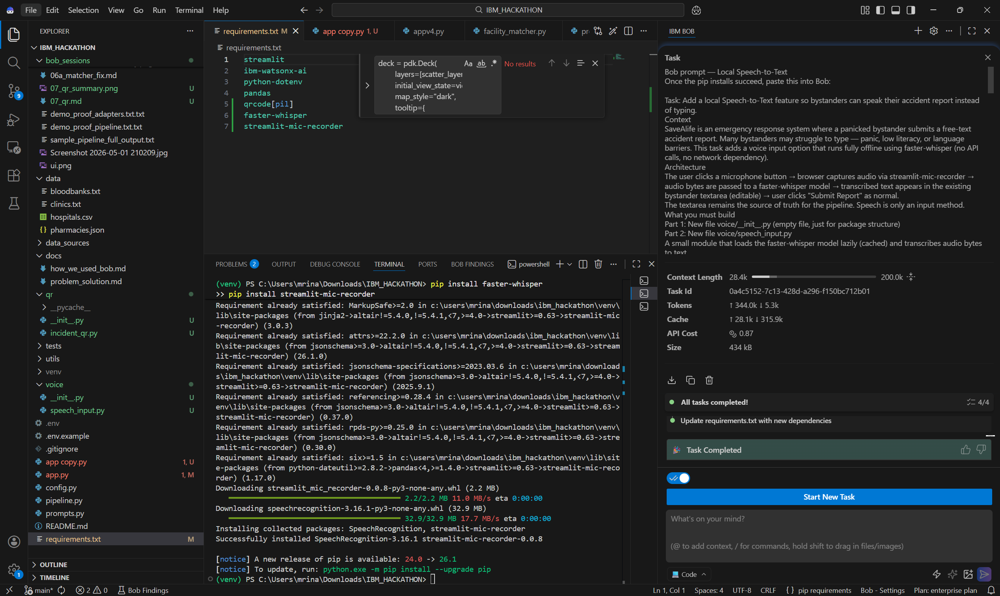

# IBM Bob Session Reports

This folder contains the **IBM Bob consumption summaries**, exported chat markdown, and demo proof artifacts for every task that built **SaveAlife with IBM**.

**Total Bob usage:** ~8 Bobcoins across 8 tasks (≈20% of the 40-coin hackathon budget).
**Total time:** ~12 hours of focused solo work.

Each task below shows: Bob's consumption summary screenshot, a link to the full Bob chat export, and a one-line description of what was built.

---

## Task 1 — Project Scaffold (~2.4 Bobcoins)

Bob built the initial folder structure, `requirements.txt`, `.env.example`, `.gitignore`, the abstract `FacilityAdapter` base class, sample data files, and the README skeleton in one focused task.

📄 [Full Bob chat export →](01_scaffold.md.md)

---

## Task 2 — Data Adapters (~0.6 Bobcoins)

Bob implemented `HospitalsCsvAdapter`, `PharmaciesJsonAdapter`, `BloodBanksTextAdapter`, plus the `watsonx_client.py` wrapper around the `ibm-watsonx-ai` SDK. The blood-bank adapter is the interesting one — it uses watsonx.ai to parse intentionally messy unstructured prose into structured records.

📄 [Full Bob chat export →](02_adapters.md.md)
🧪 [Demo proof of adapters working →](demo_proof_adapters.txt.txt)

---

## Task 3 — Three AI Agents (~0.6 Bobcoins)

Bob created `TriageAgent`, `FirstAidAgent`, and `ERHandoffAgent` — each with carefully designed system prompts, JSON output schemas, and defensive defaults for missing fields. All three call watsonx.ai's `ibm/granite-4-h-small` model via the chat API.

📄 [Full Bob chat export →](03_agents.md)

---

## Task 4 — Pipeline Orchestrator + Hospital Matcher (~1.0 Bobcoin)

Bob built `pipeline.py:run_pipeline()` — the end-to-end orchestrator that runs the three agents sequentially with timing instrumentation — plus `utils/facility_matcher.py` with Haversine distance and weighted scoring for routing patients to the most appropriate hospital.

📄 [Full Bob chat export →](04_pipeline.md)
🧪 [Sample full pipeline output →](sample_pipeline_full_output.txt)
🧪 [Demo proof →](demo_proof_pipeline.txt.txt)

---

## Task 5 — Streamlit UI (included in Task 4 budget)

Bob built the two-view Streamlit app (Bystander + ER Trauma Bay), session state for an ER queue, sample reports, dark theme, pydeck map with labeled pins, and the priority banner with P1 pulse animation.

📄 [Full Bob chat export →](05_streamlit_ui.md)
🖼 [UI screenshot →](ui.png)

---

## Task 6a — Hospital Matcher Refinement (~1.5 Bobcoins)

Bob refined the matcher to be **priority-aware**: P1 patients weight closeness 70% with a hard specialty requirement; P2/P3 use balanced scoring. After this, P1 head trauma correctly routes to Central City Hospital (neurology) over closer hospitals without neurosurgical capability.

📄 [Full Bob chat export →](06a_matcher_fix.md)

---

## Task 6 — Live Data Ingestion (~1.7 Bobcoins)

Bob added `ClinicsTextAdapter` (parses unstructured text describing new healthcare facilities), the UI upload component in the Bystander view, and map integration that displays uploaded clinics as cyan pins. **This is the project's "impact-faster" feature** — pasting any new region's data integrates them in seconds, not weeks.

📄 [Full Bob chat export →](06_clinics_upload.md)

---

## Task 7 — QR Code Handoff (~1.0 Bobcoin)

Bob built `qr/incident_qr.py` — a module that compactly summarises the incident result and renders it as a scannable QR code. Integrated into both the Bystander view and ER Trauma Bay alert cards. **Fully offline, no servers, no app needed for paramedics to scan.**

📄 [Full Bob chat export →](07_qr.md)

---

## Task 8 — Local Speech-to-Text (~2.0 Bobcoins)

Bob built `voice/speech_input.py` using **`faster-whisper`** (tiny model, fully offline) plus `streamlit-mic-recorder` UI integration. Bystanders can now **speak their report instead of typing** — no internet, no API key, no Watson STT credentials needed.

📄 [Full Bob chat export →](08_speech_input.md)

---

## Working with Bob: lessons learned

A few patterns made the human–Bob collaboration efficient:

- **One focused task per Bob conversation.** Mixing concerns produced lower-quality output and confused the session reports.
- **Explicit "do not modify" lists.** Telling Bob what *not* to touch was as important as telling it what to build — especially crucial for the late-stage QR and speech tasks where breaking the working pipeline would have been catastrophic.
- **Type-precise inputs and outputs.** Specifying exact JSON schemas eliminated guesswork.
- **Sample-first, abstract-second.** Showing Bob a concrete sample data file produced better adapters than asking for an "abstract data adapter."
- **Isolated additions.** New features (QR, speech) lived in their own folders (`qr/`, `voice/`) so they could be ripped out cleanly if they failed.

Bob wrote roughly **95% of the production code**. The remaining 5% was human-in-the-loop refinement: the watsonx.ai chat-API migration, the specialty-matching alias dictionary, and a Streamlit callback signature mismatch. Each is documented in detail in `docs/how_we_used_bob.md`.

---

**Built solo by [Mrinal Desai](mailto:mrinal.datsci@gmail.com) for the IBM Bob Dev Day Hackathon, May 2026.**